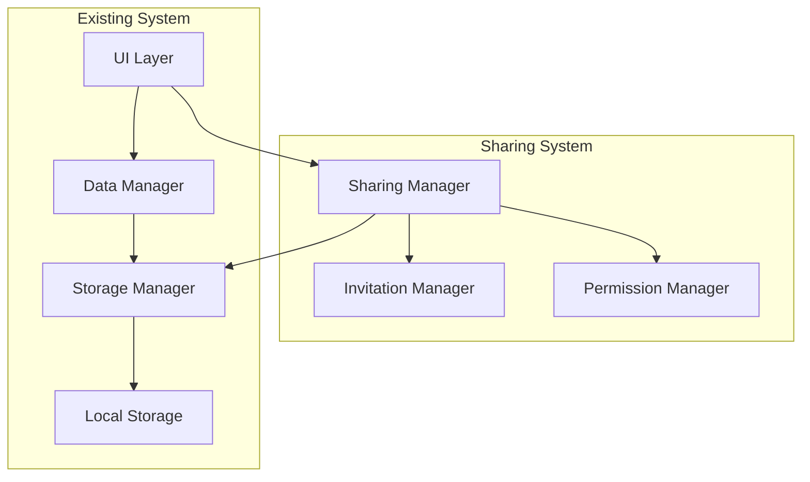

# 共有機能 設計書

## 概要

家計簿アプリに共有機能を追加し、複数のユーザーが資金元や取引データを共同管理できるようにします。この機能により、家族や共同生活者が同じ家計簿を効率的に管理できるようになります。

## アーキテクチャ

### システム構成



### データフロー

1. **招待フロー**: ユーザー → Sharing Manager → Invitation Manager → Storage
2. **受諾フロー**: 招待トークン → Invitation Manager → Permission Manager → Storage
3. **共有取引フロー**: 取引作成 → Data Manager → Sharing Manager → Storage

## コンポーネントと インターフェース

### 1. SharingManager クラス

共有機能の中核となるマネージャークラス

```javascript
class SharingManager {
    constructor(storage, authManager)
    
    // 資金元共有管理
    shareFundSource(fundSourceId, userEmails, permissions)
    unshareFundSource(fundSourceId, userId)
    getFundSourceSharingStatus(fundSourceId)
    
    // 招待管理
    sendInvitation(fundSourceId, userEmail, permissions)
    cancelInvitation(invitationId)
    getInvitations(status)
    
    // 受諾管理
    acceptInvitation(invitationToken)
    declineInvitation(invitationToken)
    validateInvitationToken(token)
    
    // 共有ユーザー管理
    getSharedUsers(fundSourceId)
    updateUserPermissions(fundSourceId, userId, permissions)
    removeSharedUser(fundSourceId, userId)
}
```

### 2. InvitationManager クラス

招待システムを管理するクラス

```javascript
class InvitationManager {
    constructor(storage)
    
    // 招待トークン管理
    generateInvitationToken(fundSourceId, inviterUserId, inviteeEmail)
    validateToken(token)
    expireToken(token)
    
    // 招待状態管理
    createInvitation(invitationData)
    updateInvitationStatus(invitationId, status)
    getInvitationByToken(token)
    cleanupExpiredInvitations()
}
```

### 3. PermissionManager クラス

権限管理を行うクラス

```javascript
class PermissionManager {
    constructor()
    
    // 権限チェック
    canViewFundSource(userId, fundSourceId)
    canEditTransaction(userId, transactionId)
    canManageFundSource(userId, fundSourceId)
    
    // 権限設定
    setUserPermissions(userId, fundSourceId, permissions)
    getUserPermissions(userId, fundSourceId)
    
    // デフォルト権限
    getDefaultPermissions()
}
```

### 4. 既存クラスの拡張

#### StorageManager の拡張

```javascript
// 新しいストレージキー
keys: {
    // 既存のキー...
    invitations: 'budget_invitations',
    sharingSettings: 'budget_sharing_settings',
    sharedUsers: 'budget_shared_users'
}

// 新しいメソッド
getInvitations()
setInvitations(invitations)
getSharingSettings()
setSharingSettings(settings)
getSharedUsers()
setSharedUsers(users)
```

#### DataManager の拡張

```javascript
// 共有関連メソッド
getSharedTransactions(userId)
canUserEditTransaction(userId, transactionId)
getTransactionsBySharedFundSource(fundSourceId)
updateTransactionSharingStatus(transactionId, isShared)
```

## データモデル

### 1. Invitation データモデル

```javascript
{
    id: string,                    // 招待ID
    token: string,                 // 招待トークン（UUID）
    fundSourceId: string,          // 共有対象の資金元ID
    inviterUserId: string,         // 招待者のユーザーID
    inviterUsername: string,       // 招待者のユーザー名
    inviteeEmail: string,          // 被招待者のメールアドレス
    permissions: {                 // 付与する権限
        canView: boolean,
        canEdit: boolean,
        canDelete: boolean
    },
    status: string,                // 'pending' | 'accepted' | 'declined' | 'expired'
    createdAt: Date,               // 作成日時
    expiresAt: Date,               // 有効期限（24時間後）
    acceptedAt: Date,              // 受諾日時（任意）
    updatedAt: Date                // 更新日時
}
```

### 2. SharingSettings データモデル

```javascript
{
    fundSourceId: string,          // 資金元ID
    ownerId: string,               // 所有者のユーザーID
    isShared: boolean,             // 共有フラグ
    sharedWith: [                  // 共有ユーザーリスト
        {
            userId: string,        // ユーザーID
            username: string,      // ユーザー名
            email: string,         // メールアドレス
            permissions: {         // 権限設定
                canView: boolean,
                canEdit: boolean,
                canDelete: boolean
            },
            joinedAt: Date         // 参加日時
        }
    ],
    createdAt: Date,               // 作成日時
    updatedAt: Date                // 更新日時
}
```

### 3. SharedUser データモデル

```javascript
{
    id: string,                    // ユーザーID
    email: string,                 // メールアドレス
    username: string,              // ユーザー名
    sharedFundSources: [           // 共有されている資金元リスト
        {
            fundSourceId: string,
            fundSourceName: string,
            permissions: {
                canView: boolean,
                canEdit: boolean,
                canDelete: boolean
            },
            sharedBy: string,      // 共有者のユーザーID
            joinedAt: Date
        }
    ],
    createdAt: Date,               // 作成日時
    updatedAt: Date                // 更新日時
}
```

### 4. 既存データモデルの拡張

#### Transaction データモデルの拡張

```javascript
{
    // 既存フィールド...
    createdBy: string,             // 作成者のユーザーID
    createdByUsername: string,     // 作成者のユーザー名
    isShared: boolean,             // 共有取引フラグ
    sharedFundSourceId: string,    // 共有資金元ID（任意）
    // 既存フィールド...
}
```

#### FundSource データモデルの拡張

```javascript
{
    // 既存フィールド...
    ownerId: string,               // 所有者のユーザーID
    isShared: boolean,             // 共有フラグ
    sharedWith: [string],          // 共有ユーザーIDリスト
    permissions: {                 // デフォルト権限設定
        canView: boolean,
        canEdit: boolean,
        canDelete: boolean
    },
    // 既存フィールド...
}
```

## エラーハンドリング

### エラータイプ定義

```javascript
const SharingErrors = {
    INVALID_TOKEN: 'INVALID_TOKEN',
    EXPIRED_TOKEN: 'EXPIRED_TOKEN',
    PERMISSION_DENIED: 'PERMISSION_DENIED',
    USER_NOT_FOUND: 'USER_NOT_FOUND',
    FUND_SOURCE_NOT_FOUND: 'FUND_SOURCE_NOT_FOUND',
    INVITATION_NOT_FOUND: 'INVITATION_NOT_FOUND',
    DUPLICATE_INVITATION: 'DUPLICATE_INVITATION',
    INVALID_EMAIL: 'INVALID_EMAIL',
    SELF_INVITATION: 'SELF_INVITATION'
};
```

### エラーハンドリング戦略

1. **バリデーションエラー**: ユーザー入力の検証失敗
   - UI上で即座にエラーメッセージを表示
   - フォームの該当フィールドをハイライト

2. **権限エラー**: アクセス権限不足
   - 警告メッセージを表示
   - ログイン画面への誘導

3. **データ整合性エラー**: データの不整合
   - エラーログを記録
   - データ同期の再試行

4. **ネットワークエラー**: 通信失敗（将来の拡張）
   - オフライン対応
   - 再試行メカニズム

## テスト戦略

### 1. 単体テスト

- **SharingManager**: 各メソッドの動作確認
- **InvitationManager**: トークン生成・検証ロジック
- **PermissionManager**: 権限チェックロジック
- **データモデル**: バリデーション機能

### 2. 統合テスト

- **招待フロー**: 招待送信から受諾まで
- **共有取引**: 共有資金元での取引作成・編集
- **権限管理**: 権限変更の反映確認
- **データ同期**: 共有データの整合性

### 3. UIテスト

- **共有設定画面**: 各種操作の動作確認
- **招待モーダル**: フォーム入力・送信
- **共有インジケーター**: 視覚的表示の確認
- **権限制御**: UI要素の表示・非表示

### 4. エラーケーステスト

- **無効なトークン**: エラーメッセージの表示
- **期限切れ招待**: 適切なエラーハンドリング
- **権限不足**: アクセス制御の確認
- **データ不整合**: 復旧メカニズム

## セキュリティ考慮事項

### 1. 招待トークンセキュリティ

- **トークン生成**: UUID v4を使用した推測困難なトークン
- **有効期限**: 24時間の制限付き
- **一回限り使用**: 使用後は無効化
- **暗号化**: ローカルストレージでの暗号化保存

### 2. 権限管理

- **最小権限の原則**: 必要最小限の権限のみ付与
- **権限継承**: 所有者 > 共有ユーザーの階層構造
- **権限検証**: 各操作前の権限チェック
- **権限取り消し**: 即座の権限無効化

### 3. データ保護

- **データ分離**: ユーザー間のデータ分離
- **アクセス制御**: 共有データへの適切なアクセス制御
- **監査ログ**: 共有操作の記録（将来の拡張）
- **データ削除**: 共有解除時の適切なクリーンアップ

### 4. 入力検証

- **メールアドレス**: 正規表現による形式チェック
- **権限設定**: 有効な権限値の検証
- **ユーザー入力**: XSS対策のためのサニタイズ
- **データ整合性**: 参照整合性の維持

## パフォーマンス考慮事項

### 1. データ効率化

- **インデックス化**: 共有データの高速検索
- **キャッシュ戦略**: 頻繁にアクセスされるデータのキャッシュ
- **遅延読み込み**: 必要時のみデータ読み込み
- **データ圧縮**: ストレージ使用量の最適化

### 2. UI応答性

- **非同期処理**: 重い処理の非同期実行
- **プログレス表示**: 長時間処理の進捗表示
- **楽観的UI**: 操作結果の先行表示
- **エラー回復**: 失敗時の適切な状態復旧

### 3. メモリ管理

- **オブジェクト再利用**: 不要なオブジェクト生成の回避
- **イベントリスナー**: 適切なクリーンアップ
- **メモリリーク**: 循環参照の回避
- **ガベージコレクション**: 効率的なメモリ解放

## 実装フェーズ

### フェーズ1: 基盤構築
- SharingManager, InvitationManager, PermissionManager の実装
- データモデルの拡張
- 基本的なストレージ機能

### フェーズ2: 招待システム
- 招待送信・受諾機能
- トークン管理システム
- 招待UI の実装

### フェーズ3: 共有管理
- 資金元共有設定
- 共有ユーザー管理
- 権限管理UI

### フェーズ4: 共有取引
- 共有取引の作成・編集
- 共有インジケーター
- フィルタリング機能

### フェーズ5: 最適化・テスト
- パフォーマンス最適化
- セキュリティ強化
- 包括的テスト実施